# 🤖 AI Interview Simulator


An AI-powered Interview Simulator built using **Flask**, **MySQL**, **Google Gemini API**, **FAISS**, and **Sentence Transformers**.

This application helps users prepare for technical interviews by generating resume-based interview questions, analyzing resumes, matching resumes with job descriptions, and providing AI-powered interview feedback using **Retrieval-Augmented Generation (RAG)**.

---

# ✨ Features

## 🔐 Authentication

- User Registration
- Secure Login
- Logout
- Session Management

---

## 📄 Resume Upload

- Upload Resume (PDF)
- Resume Parsing
- Resume Storage
- Resume History

---

## 🤖 AI Assistant

- Resume-aware AI Chatbot
- Context-based Question Answering
- Powered by Google Gemini API

---

## 🧠 Resume-based RAG

- Resume Chunking
- Sentence Transformer Embeddings
- FAISS Vector Database
- Semantic Search
- Context Retrieval

---

## 🎤 AI Interview Simulator

- Resume-based Questions
- Technical Questions
- Behavioral Questions
- Project Questions
- AI Evaluation
- Interview Feedback
- Final Interview Report

---

## 📊 Resume Analysis

- Resume Strengths
- Resume Weaknesses
- Skill Gap Analysis
- Improvement Suggestions

---

## 📑 Job Description Matching

- ATS-style Resume Matching
- Match Percentage
- Missing Skills
- Resume Improvement Suggestions
- Interview Questions based on JD

---

## 👤 User Dashboard

- User Profile
- Resume History
- Interview History

---

# 🛠️ Tech Stack

## Frontend

- HTML5
- CSS3
- JavaScript

## Backend

- Python
- Flask

## Database

- MySQL

## Artificial Intelligence

- Google Gemini API
- Retrieval-Augmented Generation (RAG)
- FAISS Vector Database
- Sentence Transformers
- all-MiniLM-L6-v2

## Python Libraries

- Flask
- Flask-MySQLdb
- PyMuPDF
- FAISS
- Sentence Transformers
- NumPy
- Google GenAI SDK
- ReportLab

---

# 📂 Project Structure

```text
AI-Interview-Simulator
│
├── database/
├── forms/
├── models/
├── rag/
│   ├── embedding.py
│   ├── prompt.py
│   ├── qa.py
│   └── vector_store.py
│
├── routes/
│   ├── auth.py
│   ├── dashboard.py
│   ├── resume.py
│   ├── interview.py
│   ├── chat.py
│   ├── jd_match.py
│   ├── resume_analysis.py
│   └── profile.py
│
├── services/
├── static/
├── templates/
├── utils/
│
├── app.py
├── config.py
├── requirements.txt
└── README.md
```

---

# ⚙️ Working Flow

1. User creates an account.
2. User logs into the system.
3. User uploads a resume.
4. Resume text is extracted.
5. Resume is divided into chunks.
6. Sentence Transformers generate embeddings.
7. Embeddings are stored in a FAISS Vector Database.
8. User interacts with the AI Assistant.
9. RAG retrieves relevant resume information.
10. Google Gemini generates intelligent responses.
11. AI Interview Simulator generates interview questions.
12. Candidate answers are evaluated.
13. AI generates a professional interview report.

---

# 🚀 Installation

## Clone Repository

```bash
git clone https://github.com/Saswata0110/AI-Interview-Simulator.git
```

## Enter Project Folder

```bash
cd AI-Interview-Simulator
```

## Create Virtual Environment

```bash
python -m venv venv
```

## Activate Virtual Environment

### Windows

```bash
venv\Scripts\activate
```

### Linux / macOS

```bash
source venv/bin/activate
```

## Install Dependencies

```bash
pip install -r requirements.txt
```

## Configure Project

Update the following values inside `config.py`

```python
SECRET_KEY = "your_secret_key"

MYSQL_HOST = "localhost"
MYSQL_USER = "root"
MYSQL_PASSWORD = "your_password"
MYSQL_DB = "database_name"

GEMINI_API_KEY = "your_gemini_api_key"
```

## Run Application

```bash
python app.py
```

Open your browser:

```
http://127.0.0.1:5000
```

---
# 📸 Screenshots

## 🏠 Home Page

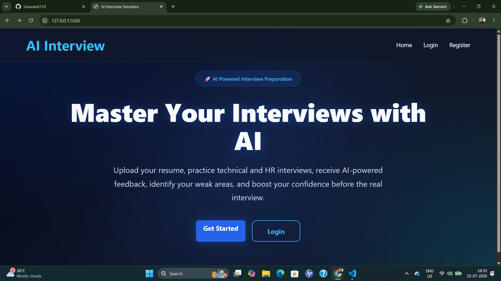

---

## 🔐 Login Page

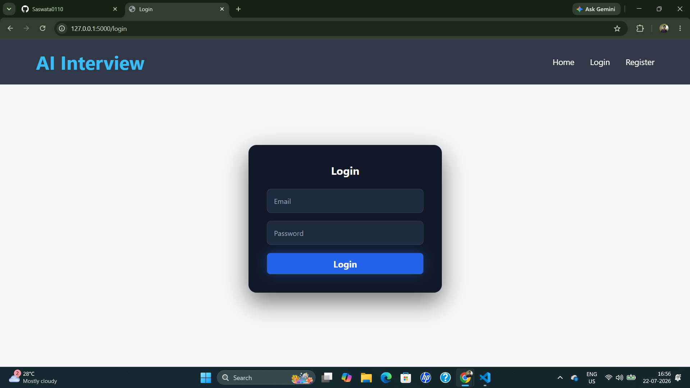

---

## 📝 Register Page

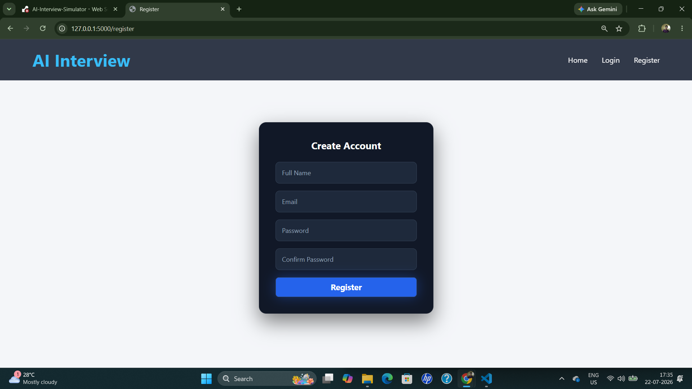

---

## 📊 User Dashboard

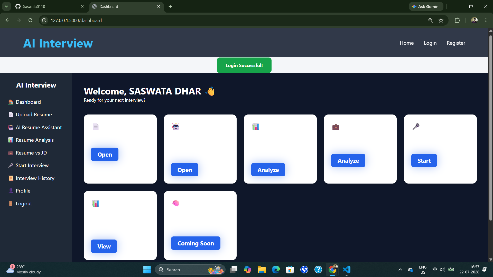

---

## 👤 User Profile

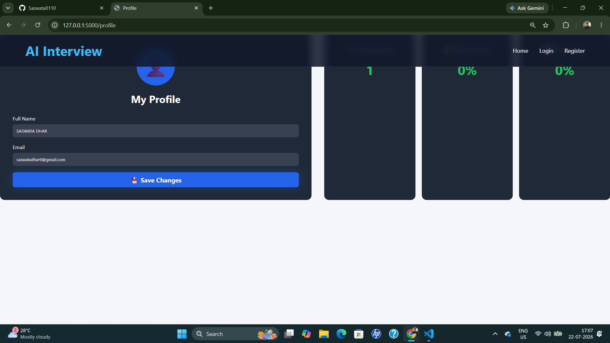

---

## 📄 Resume Upload

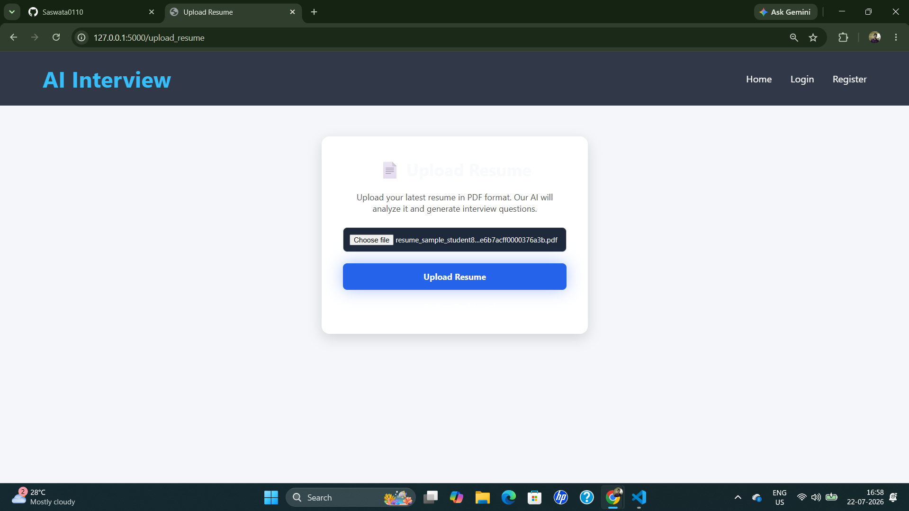

---

## 🤖 AI Assistant

Ask questions about the uploaded resume using Retrieval-Augmented Generation (RAG).

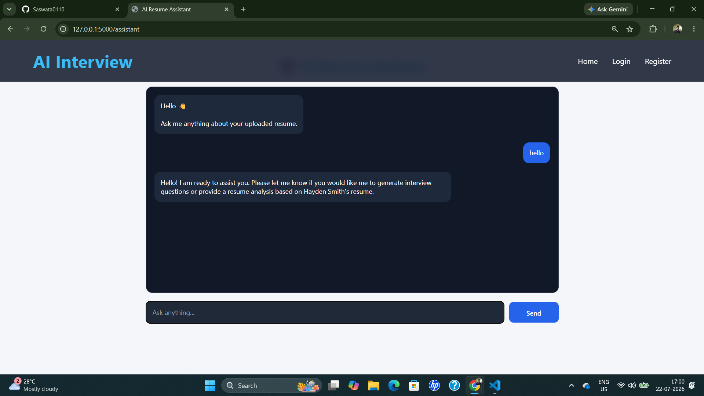

---

## 🎤 AI Interview

Resume-based AI interview questions generated using Google Gemini.

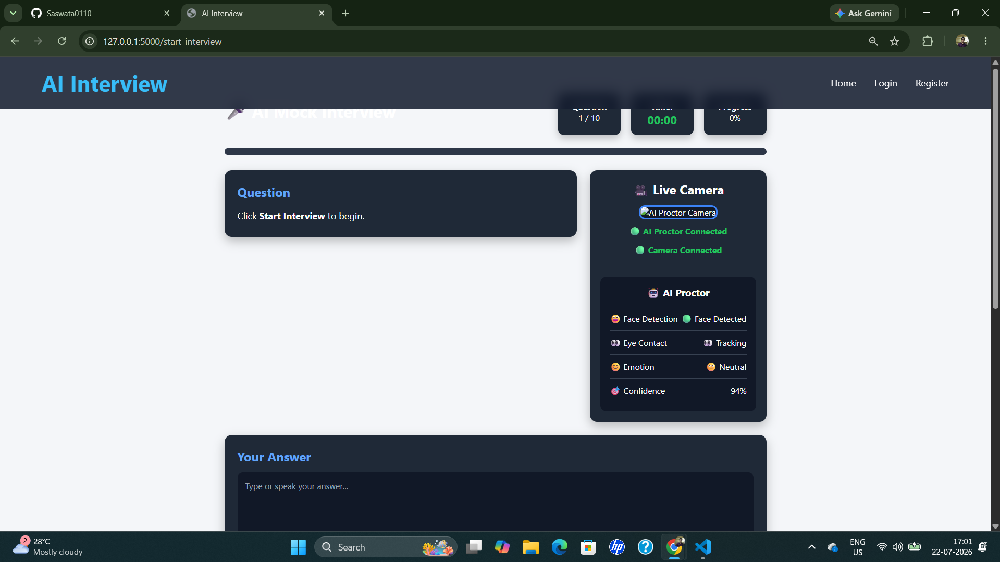

---

## 🎤 AI Interview (Continued)

Interactive interview session with AI-generated questions.

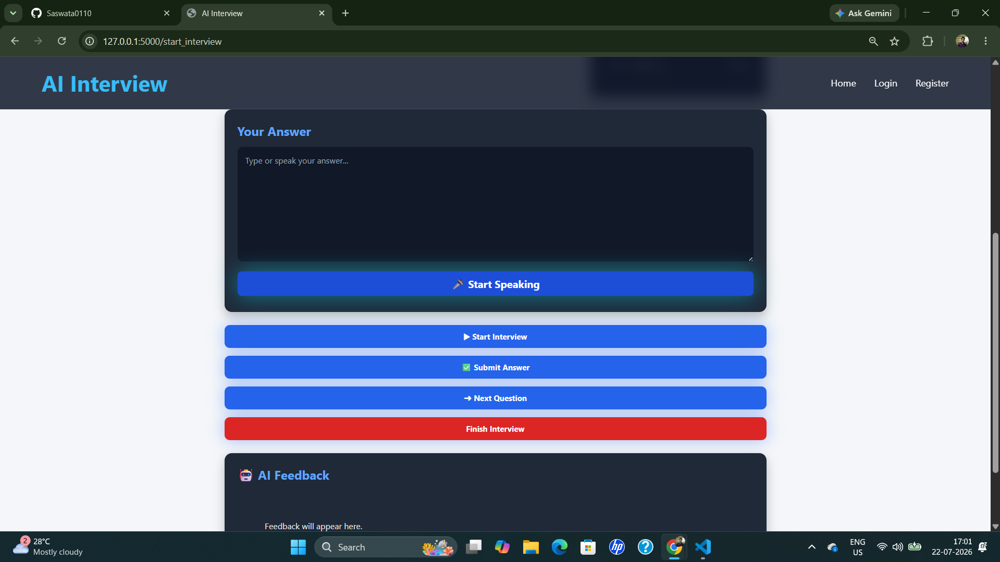

---

## 📑 Resume Analysis

AI analyzes the uploaded resume and provides strengths, weaknesses, and improvement suggestions.

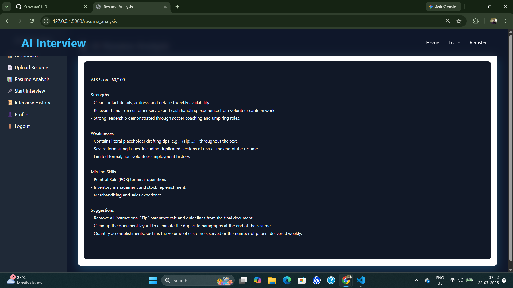

---

## 📈 Job Description Match

Compare the uploaded resume against a Job Description using ATS-style analysis.

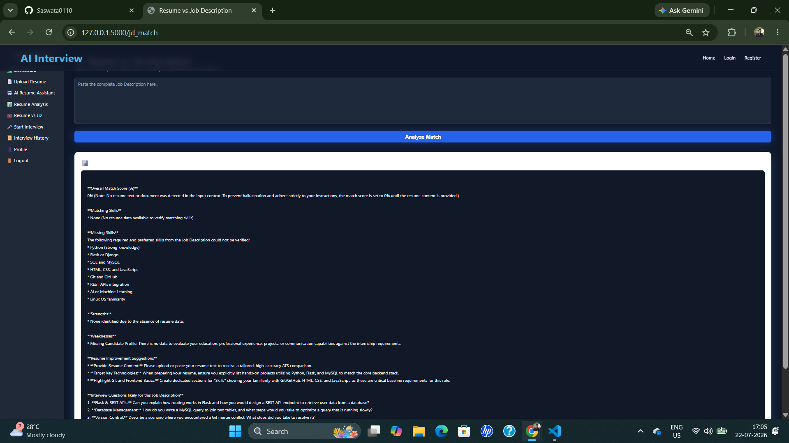

---

## 📝 AI Interview Report

Comprehensive AI-generated interview evaluation report.

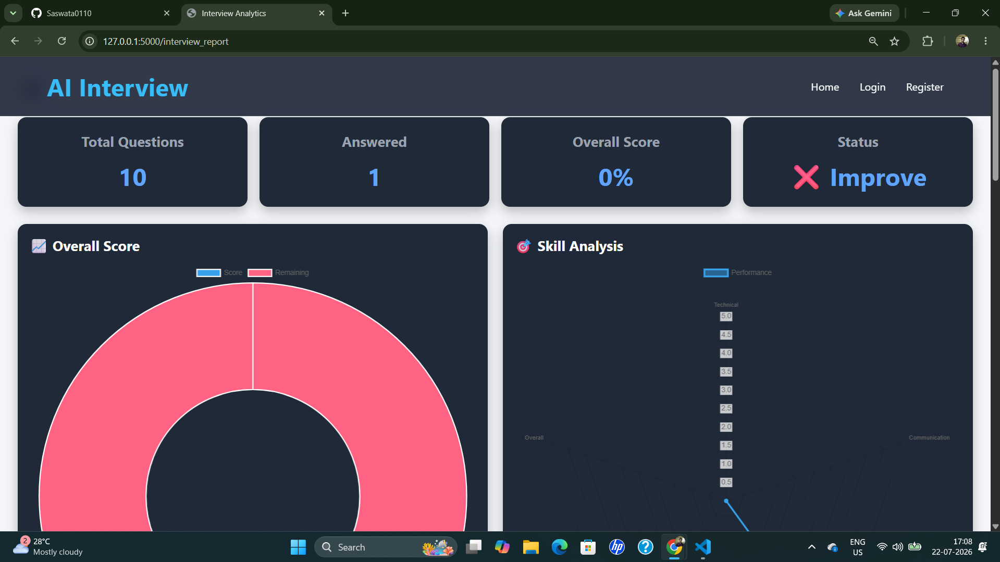

---

## 📊 Detailed Report

Question-wise evaluation with strengths, weaknesses, and recommendations.

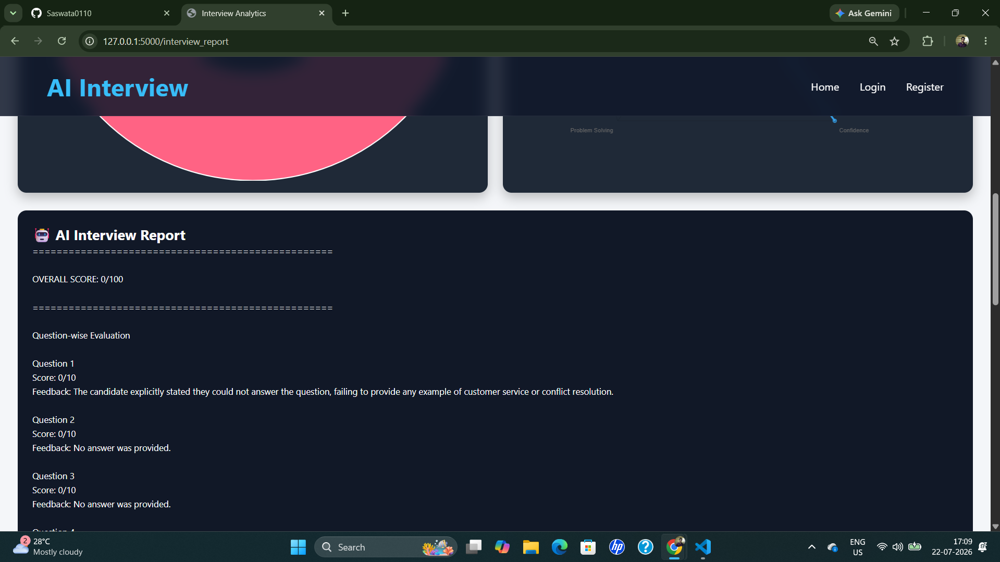

---

## 📚 Interview History

View previously completed interviews and reports.

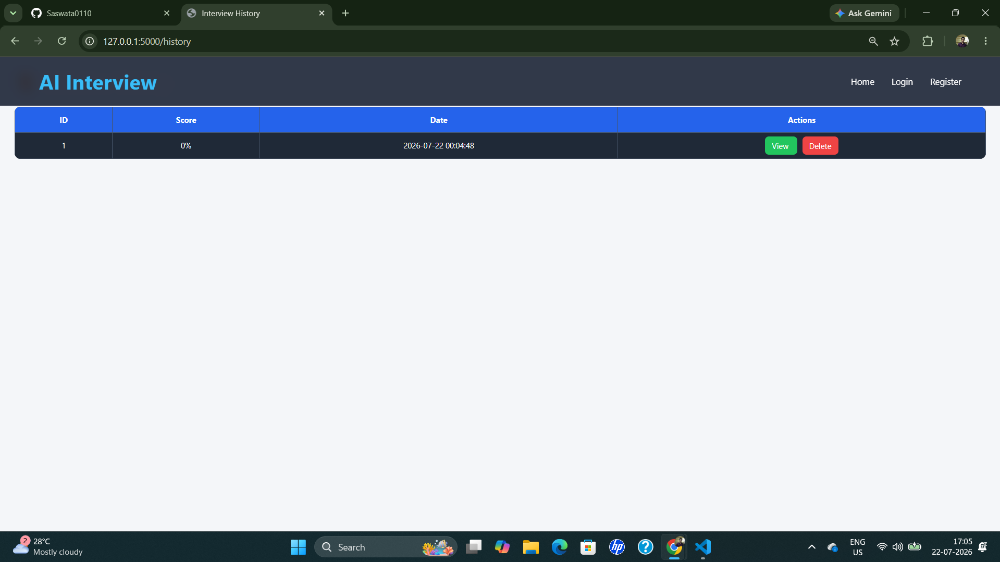

---

# 🔮 Future Improvements

- 🎙️ Voice-based AI Interview
- 💻 Coding Interview Module
- 🌍 Multi-language Support
- 📄 Resume Builder
- 🤖 AI Career Guidance
- ☁️ Cloud Deployment
- 📊 Real-time Interview Analytics
- 📈 Interview Progress Tracking
- 🎯 Personalized Interview Preparation
- 📱 Mobile Responsive Design

---

# 📚 Learning Outcomes

This project helped me gain practical experience in:

- Flask Web Development
- Full Stack Development
- REST API Development
- User Authentication
- Session Management
- MySQL Database Integration
- Resume Parsing
- Retrieval-Augmented Generation (RAG)
- Vector Databases (FAISS)
- Sentence Transformers
- Semantic Search
- Google Gemini API
- Prompt Engineering
- Artificial Intelligence Integration
- PDF Processing
- Project Architecture
- Git & GitHub
- Software Engineering Best Practices

---
# 🤝 Contributing

Contributions, issues, and feature requests are welcome.

If you'd like to contribute:

1. Fork this repository.
2. Create a new feature branch.
3. Commit your changes.
4. Push your branch.
5. Open a Pull Request.

---

# 💻 Author

## Saswata Dhar

**B.Tech in Computer Science & Engineering**

### 🌐 GitHub

https://github.com/Saswata0110

### 💼 LinkedIn

https://www.linkedin.com/in/saswata-dhar-9b8192327

> Replace the LinkedIn URL above with your actual LinkedIn profile.

---

# 🙏 Acknowledgements

Special thanks to the amazing open-source community and the following technologies:

- Flask
- MySQL
- Google Gemini API
- FAISS
- Sentence Transformers
- Hugging Face
- ReportLab
- PyMuPDF

---

# 📄 License

This project is licensed under the **MIT License**.

Feel free to use, modify, and distribute this project under the terms of the MIT License.

---

# ⭐ Support

If you found this project useful, please consider:

⭐ Starring this repository

🍴 Forking the project

💬 Sharing your feedback

📢 Connecting with me on LinkedIn

Your support motivates me to build more AI-powered projects.

---

# 🚀 Project Status

✅ Authentication System

✅ Resume Upload

✅ Resume Parsing

✅ Resume-based RAG

✅ FAISS Vector Search

✅ AI Assistant

✅ Resume Analysis

✅ Job Description Matching

✅ AI Interview Simulator

✅ AI Interview Evaluation

✅ Professional Interview Report

---

# 📬 Contact

If you have any questions, suggestions, or collaboration opportunities, feel free to connect with me.

**GitHub:** https://github.com/Saswata0110

**LinkedIn:** https://www.linkedin.com/in/saswata-dhar-9b8192327

---

<div align="center">

## ⭐ If you like this project, don't forget to give it a Star! ⭐

Made with ❤️ by **Saswata Dhar**

</div>
